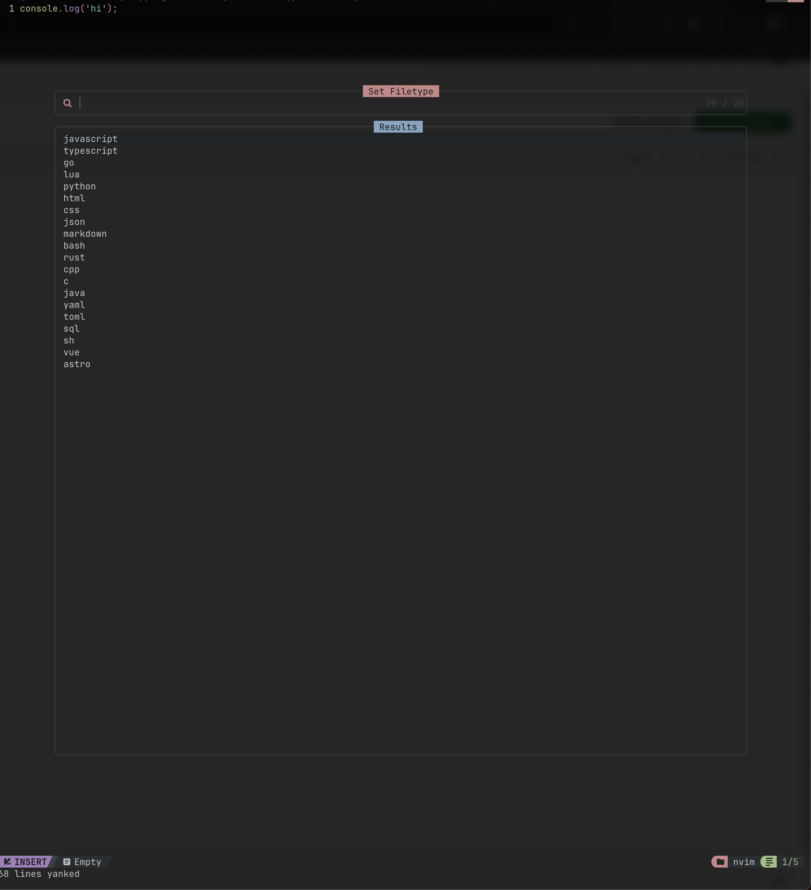

# Fast-filetype-switcher-neovim



Require the plugin from init.lua
```
-- Require utils
local utils = require "utils"
utils.setup() -- This registers the :Run command
```


Set the keybindings
```
-- Fast Filetype switcher
vim.keymap.set("n", "<leader>sf", function()
  require("plugins.fast-filetype").pick_filetype()
end, { desc = "Pick and set filetype" })

```
